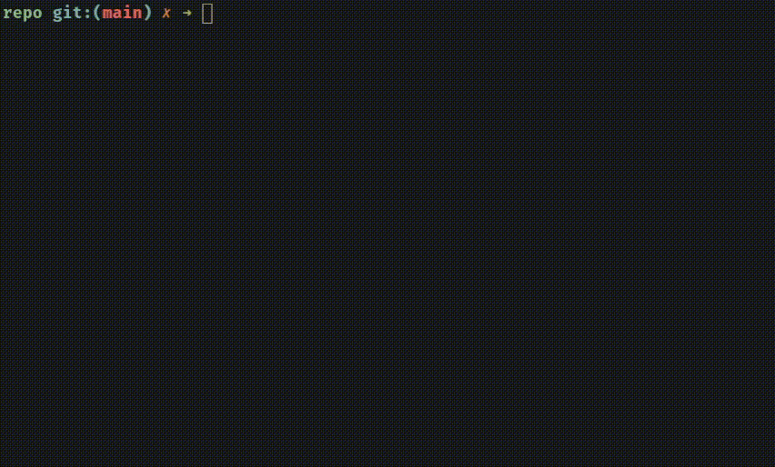

# `sema` - semantic commit tool

This is a simple command line tool inspired by [this gist][gist] about semantic
commit messages. In short, it proposed to use labelled commit messages that
derive their format from [Angular's commit rules][angular].

[gist]: https://gist.github.com/joshbuchea/6f47e86d2510bce28f8e7f42ae84c716
[angular]: https://github.com/angular/angular.js/blob/master/DEVELOPERS.md#commits

The `sema` command will help you follow these guidelines with no effort on your
part to memorise labels or double-check things.

## 🚨 Major Version Bump Notice

### Breaking Changes

Recent introduction of the first major release version `v1.0.0` carries a few
**breaking changes** outlined here:

1. Length limit of 15 characters has been removed from the **change scope**
   field: _developer knows best_ (LOL).
2. The `--more` flag is deprecated. Now, `sema` will show you label descriptions
   during the selection process.
3. The short version of the `--version` flag is now `-v` instead of `-n` for
   obvious reasons.

### Install with Homebrew

From now on, you can install `sema` using Homebrew. Follow through to the
[Installation](#install) section to learn more!

## 🌎 Contents

1. [Format](#format)
2. [Installation](#install)
3. [Usage](#usage)
4. [Screenshots](#demo)

## <a name="format"></a> 🍭 Format

Each commit message is supposed to be formatted in the following way:

```
TYPE(SCOPE): MESSAGE
```

Where `SCOPE` tells you about the scope of changes, `MESSAGE` summarises those
in a concise way, and `TYPE` is a short label from the following:

- `feat`: new feature for the user
- `fix`: bug fix for the user
- `docs`: changes to the documentation
- `style`: formatting with no production code change
- `refactor`: refactoring production code
- `test`: adding missing tests, refactoring tests
- `perf`: performance improvements
- `chore`: updating grunt tasks

## <a name="install"></a> 🚀 Installation

### Homebrew

```bash
brew install sharpvik/sema/sema
```

### AUR (for Arch-based Linux)

```bash
yay -S sema
```

### Using the `go` tool

```bash
go install github.com/sharpvik/sema
```

> Both installation methods put `sema` binary into your `$GOPATH/bin` so make
> sure that your `$GOPATH/bin` is in `$PATH`!

## <a name="usage"></a> 🔭 Usage

### Overview

```bash
Usage: sema [flags]

 -a, --add         Begin by running `git add`
 -f, --force       Force push changes with `git push -f`
 -l, --long        Open editor to elaborate commit message
 -p, --push        Run `git push` on successful commit

 -c, --contribute  Open sema GitHub repository in browser
 -h, --help        Display help message
 -v, --version     Display current version of sema
```

### Flag Combos

#### Add & Push

The `--push` and `--add` flags can be combined (or `-ap`), which will be
equivalent to running the following:

```bash
git add .
git commit -m "feat(*): commit description"
git push
```

#### Force Push

Adding the `--force` flag to `--push` (or `-pf`) runs forceful push:

```bash
git push -f
```

> The `--force` used without `--push` will be ignored.

### Long Commits

By default, `git commit` opens an editor in your terminal where you can write a
commit message. For shorter commits, one could use `git commit -m "*****"`,
which is the default mode of operation for `sema`.

However, sometimes it is very beneficial to be able to elaborate your commit
message instead of just posting a semantic title. For this use case, meet the
new `--long` execution flag: after helping you come up with a semantic commit
title, it will open an editor (with your title prepended at the top) and let you
write some prose or poetry (whatever helps you get promotions).

### Commit Hooks

Sometimes we'd like to run a script before every commit. For example, I often
forget to run `go fmt ./...` before publishing changes. To combat this issue,
introducing **commit hooks**.

Every time you run `sema`, it will look for a file called `hooks.sema` in the
current working directory and attempt to execute it. Make sure to give executive
permissions to the hooks file (consider `chmod +x hooks.sema`).

Of course, using `hooks.sema` is optional and its absence won't break anything.
For a basic example of such a file, take a look at [`hooks.sema`](./hooks.sema).

## <a name="demo"></a> 🌌 Demo


