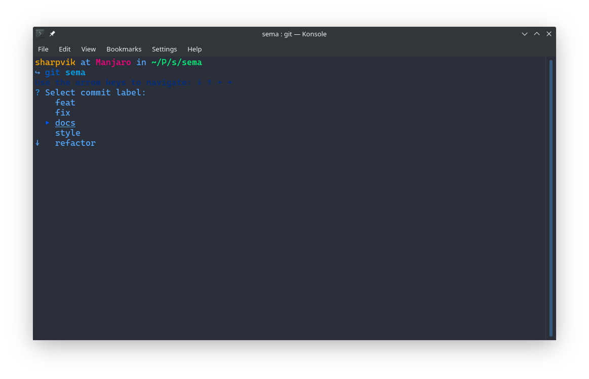
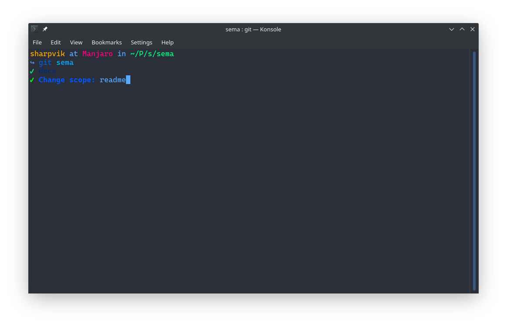
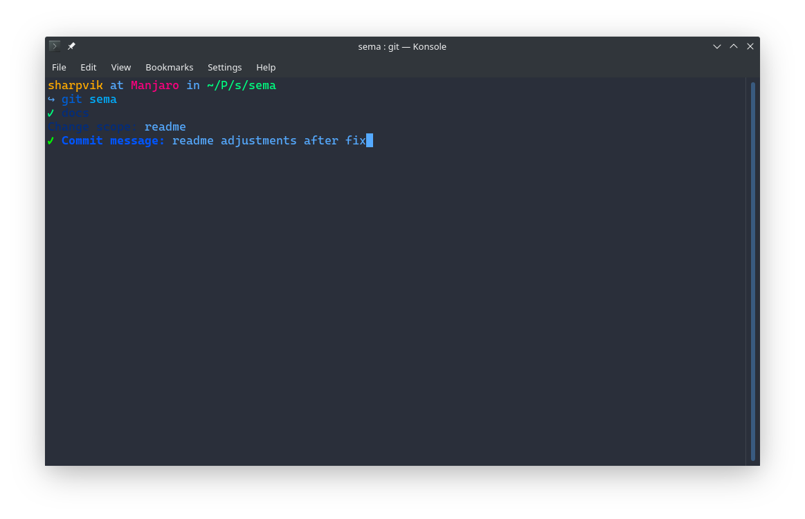
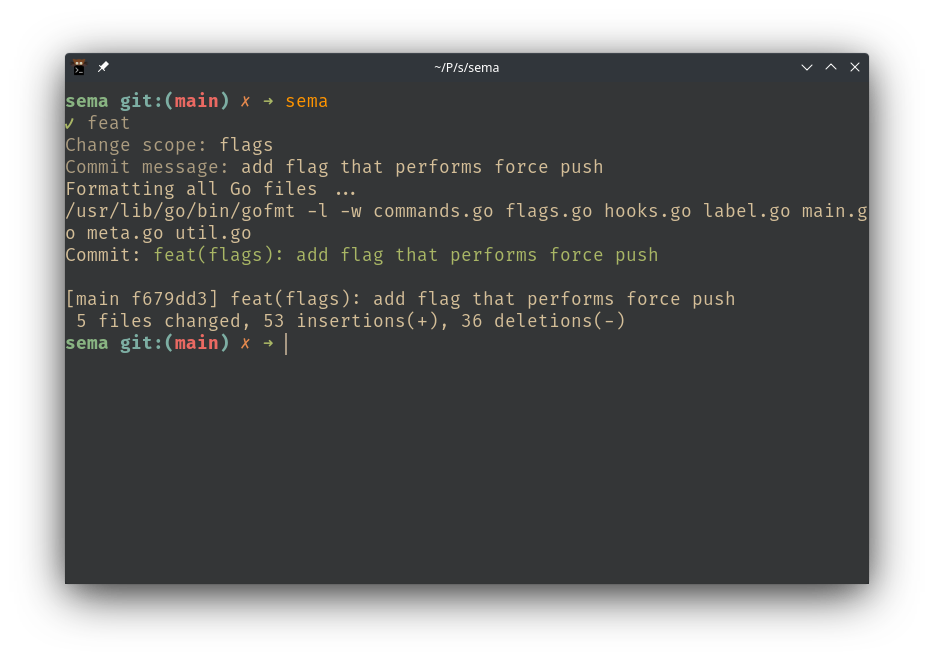

# `sema` - semantic commit tool

This is a simple command line tool inspired by [this gist][gist] about semantic
commit messages. In short, it proposed to use labelled commit messages that
derive their format from [Angular's commit rules][angular].

The `sema` command will help you follow these guidelines with no effort on your
part to memorise labels or double-check things.

[gist]: https://gist.github.com/joshbuchea/6f47e86d2510bce28f8e7f42ae84c716
[angular]: https://github.com/angular/angular.js/blob/master/DEVELOPERS.md#commits

## Format

Each commit message is supposed to be formatted in the following way:

```
TYPE(SCOPE): MESSAGE
```

Where `SCOPE` tells you about the scope of changes, `MESSAGE` summarises those
in a concise way, and `TYPE` is a short label from the following:

- `Feat`: new feature for the user
- `Fix`: bug fix for the user
- `Docs`: changes to the documentation
- `Style`: formatting with no production code change
- `Refactor`: refactoring production code
- `Test`: adding missing tests, refactoring tests
- `Chore`: updating grunt tasks

> You can see the list of these labels with explanations using `sema -help`.

## Installation

```bash
go install github.com/sharpvik/sema  # => $GOPATH/bin/sema
```

**NOTICE:** Make sure that your `$GOPATH/bin` is in `$PATH`!

## Usage

```bash
sema -help  # if you need a hint
sema        # to commit changes in current repo
```





